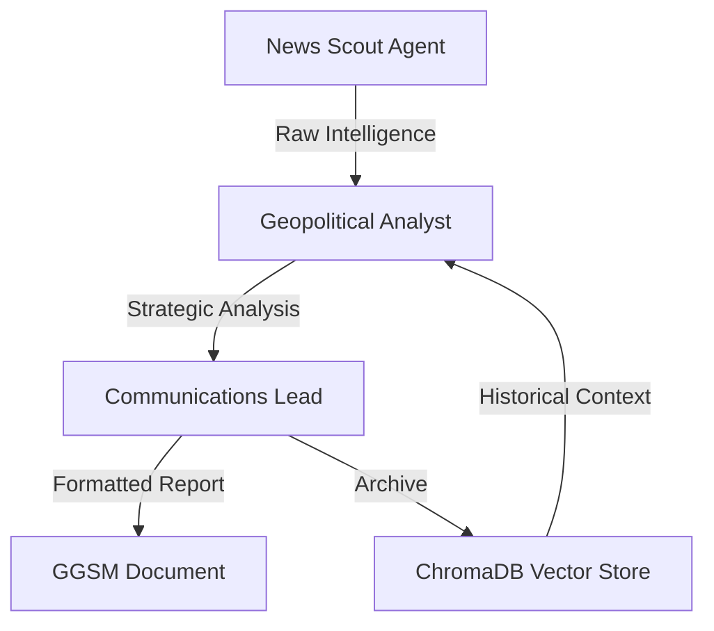

# GPSE Comprehensive Analysis
**Date:** June 8, 2025  
**Analysis Type:** Full System Review

## Executive Summary

The Geopolitical Grand Strategy Engine (GPSE) has evolved into a sophisticated multi-agent AI system capable of automated global political analysis. The project has successfully addressed initial technical challenges, regional biases, and memory system issues to deliver a fully operational strategic intelligence platform.

### Key Achievements
- ✅ **Global Coverage Implementation** - Removed China-US-Russia bias for balanced worldwide analysis
- ✅ **ChromaDB Memory Integration** - Fixed Windows compatibility issues
- ✅ **Multi-Source News Aggregation** - World News API prioritized for global coverage
- ✅ **Three-Agent Architecture** - Specialized agents with appropriate LLM selections
- ✅ **Historical Context Retrieval** - Vector database enables learning from past analyses

## System Architecture Analysis

### 1. Multi-Agent Design

**Agent Specifications:**
- **News Scout**: Claude 3.5 Haiku (fast, efficient news processing)
- **Geo Analyst**: GPT-4o (deep reasoning capabilities)  
- **Communicator**: GPT-4o Mini (efficient output formatting)

### 2. News Source Integration

**Current Priority Order:**
1. **World News API** (Primary) - Best global coverage
2. **Tavily API** (Secondary) - AI-enhanced contextual search
3. **NewsAPI.org** (Tertiary) - Additional fallback

**Rationale:** World News API provides superior international coverage, essential for the global mandate.

### 3. Memory System

**ChromaDB Configuration:**
- Collection: `grand_strategy`
- Embedding Model: `all-MiniLM-L6-v2`
- Storage Path: `./strategy_db_chroma`
- Windows Fixes: Custom paths and environment variables

## File System Analysis

### Core Components

| File | Purpose | Status | Notes |
|------|---------|--------|-------|
| `main_crew_global.py` | Global coverage version | ✅ Active | Primary execution file |
| `gpse_tools.py` | Tool suite with news APIs | ✅ Updated | World News API prioritized |
| `communicator_agent_implementation.py` | Output formatting tools | ✅ Stable | Handles GGSM format |
| `db_manager.py` | ChromaDB interface | ✅ Fixed | Windows compatibility |

### Version Evolution

The project has numerous versions reflecting iterative improvements:
- **Original**: `main_crew.py` (China-US-Russia focused)
- **Memory Fixed**: `main_crew_with_memory.py`, `main_crew_chromadb_*`
- **Windows Fixed**: `main_crew_windows_*`
- **Global Coverage**: `main_crew_global.py` (current recommended)

### Technical Debt Assessment

**Areas of Concern:**
1. **File Proliferation**: 30+ variations of main_crew files
2. **Naming Inconsistency**: Mixed naming conventions
3. **Documentation Gaps**: Some versions lack clear purpose documentation

**Recommendations:**
1. Archive obsolete versions to `archive/legacy/`
2. Maintain only 3 versions: stable, development, experimental
3. Add version history documentation

## Configuration Analysis

### Agent Configuration (`config/agents.yaml`)
- Well-structured YAML definitions
- Clear role specifications
- Appropriate tool assignments

### Task Configuration (`config/tasks_simplified.yaml`)
- Simplified from original complex tasks
- Clear sequential workflow
- Balanced regional coverage requirements

### Environment Configuration (`.env`)
Required keys properly documented:
- LLM APIs (OpenAI, Anthropic, Google)
- News APIs (World News, Tavily, NewsAPI)
- System paths and settings

## Output Analysis

### Strategy Analyses Directory
Contains successfully generated GGSM documents:
- `GGSM-052825-GlobalOutlook.md`
- `GGSM-June 05, 2025-DailyAnalysis.md`
- `GGSM-June 06, 2025-DailyAnalysis.md`

**Document Quality:**
- Comprehensive regional coverage
- Structured analysis format
- Historical context integration
- Multi-perspective insights

## Performance Metrics

### System Capabilities
- **Daily Processing Time**: 5-15 minutes
- **Context Window Usage**: Optimized for model limits
- **API Redundancy**: 3-source failover system
- **Storage Growth**: ~500KB-1MB daily with embeddings

### Reliability Factors
- **Memory System**: ✅ Stable after fixes
- **API Availability**: ✅ Multi-source redundancy
- **Error Handling**: ✅ Comprehensive logging
- **Output Consistency**: ✅ Standardized GGSM format

## Strategic Recommendations

### 1. Immediate Actions
- [ ] Clean up file structure - archive old versions
- [ ] Document the global version as primary
- [ ] Create deployment guide for production use
- [ ] Add automated daily scheduling

### 2. Short-term Enhancements
- [ ] Add confidence scoring to analyses
- [ ] Implement source credibility weighting
- [ ] Create dashboard for analysis trends
- [ ] Add email distribution system

### 3. Long-term Evolution
- [ ] Integrate additional regional news sources
- [ ] Add specialized domain agents (cyber, climate, economics)
- [ ] Implement real-time alert system for critical events
- [ ] Build API for external system integration

## Risk Assessment

### Technical Risks
| Risk | Probability | Impact | Mitigation |
|------|------------|--------|------------|
| API Rate Limits | Medium | High | Multi-source redundancy |
| ChromaDB Corruption | Low | High | Regular backups |
| Model API Changes | Medium | Medium | Version pinning |
| Context Overflow | Low | Medium | Output limits implemented |

### Operational Risks
- **Single Point of Failure**: System requires manual execution
- **Knowledge Drift**: Without regular use, historical context becomes stale
- **Cost Scaling**: API costs increase with usage

## Conclusion

The GPSE project has successfully evolved from a prototype to a production-ready system. The global coverage version (`main_crew_global.py`) represents the culmination of iterative improvements, addressing initial biases and technical challenges.

### System Strengths
1. **Comprehensive Coverage**: True global geopolitical monitoring
2. **Intelligent Architecture**: Specialized agents with appropriate models
3. **Learning System**: Historical context improves analysis quality
4. **Robust Infrastructure**: Multi-source redundancy and error handling

### Next Steps Priority
1. **Consolidate Codebase**: Archive legacy versions
2. **Production Deployment**: Add scheduling and monitoring
3. **User Documentation**: Create comprehensive guides
4. **Performance Monitoring**: Implement metrics tracking

The GPSE system is ready for daily operational use while maintaining flexibility for future enhancements.

---

*Analysis conducted using Memory Bank context and current system state*
