# 🌍 GPSE - Geopolitical Grand Strategy Engine

<div align="center">


**An AI-powered system for automated geopolitical analysis and strategic synthesis**

[Features](#-key-features) • [Architecture](#-architecture) • [Installation](#-installation) • [Usage](#-usage) • [Documentation](#-documentation)

</div>

---

## 🎯 Overview

GPSE (Geopolitical Grand Strategy Engine) is an automated intelligence system that continuously monitors global political events, synthesizes them with historical context, and produces evolving strategic analyses. Using a multi-agent AI architecture, it transforms the overwhelming flow of global information into actionable strategic insights.

### 🌟 What Makes GPSE Unique

- **Automated Daily Analysis**: Runs at 10 AM EST to capture and analyze global developments
- **Historical Context Integration**: Every analysis builds upon previous insights stored in a vector database
- **Multi-Perspective Synthesis**: Considers various geopolitical actors' viewpoints and strategic positions
- **Growing Intelligence**: The system becomes more sophisticated over time as its knowledge base expands

## 🏗️ Architecture

### System Flow Diagram

```mermaid
graph TB
    A[🕐 Daily Trigger<br/>10:00 AM EST] --> B[📰 News Gathering<br/>Agent]
    B --> C{Multiple<br/>News APIs}
    C --> D[Tavily AI<br/>Research]
    
    B --> E[🧠 Lead Strategy<br/>Analyst]
    D --> E
    
    E --> F[(ChromaDB<br/>Vector Store)]
    F --> E
    
    E --> G[🌐 Geo-Strategic<br/>Analyst]
    G --> H[📄 Communications<br/>& Archive Agent]
    
    H --> I[Strategy Document<br/>GGSM-MMDDYY-*.md]
    H --> F
    
    style A fill:#ff6b6b,stroke:#fff,color:#fff
    style E fill:#4ecdc4,stroke:#fff,color:#fff
    style G fill:#45b7d1,stroke:#fff,color:#fff
    style F fill:#f39c12,stroke:#fff,color:#fff
```



### Multi-Agent Architecture

```mermaid
graph LR
    subgraph "🤖 AI Agents"
        A1[Information Curator<br/>GPT-3.5 Turbo]
        A2[Strategy Analyst<br/>Claude 4 Opus]
        A3[Geo-Strategic Analyst<br/>Claude 4 Opus]
        A4[Communications Lead<br/>GPT-3.5 Turbo]
    end
    
    subgraph "🔧 Tools & APIs"
        T1[News APIs]
        T2[Tavily Search]
        T3[ChromaDB Query]
        T4[File Operations]
    end
    
    subgraph "💾 Storage"
        S1[Vector Database<br/>ChromaDB]
        S2[Strategy Documents<br/>Markdown Files]
    end
    
    A1 --> T1
    A1 --> T2
    A2 --> T3
    A3 --> T3
    A4 --> T4
    A4 --> S1
    A4 --> S2
```



## 🚀 Key Features

### 📊 Intelligent Analysis Pipeline
- **Multi-Source News Aggregation**: Gathers data from multiple global news APIs
- **AI-Enhanced Research**: Uses Tavily for deep-dive investigations
- **Contextual Memory**: ChromaDB stores and retrieves relevant historical analyses
- **Strategic Metadata Tagging**: Identifies [Actors], [Inferred Ends], [Means], [Flashpoints]

### 🧠 Advanced AI Capabilities
- **Three-Tier Agent System**: Specialized agents for gathering, analysis, and documentation
- **LLM Flexibility**: Supports OpenAI GPT-4, Anthropic Claude 4, and local models
- **Embedding Intelligence**: Uses sentence-transformers for semantic search

### 📈 Growing Knowledge Base
- **Vector Storage**: Efficient retrieval of relevant historical context
- **Section-Based Chunking**: Granular storage for precise information retrieval
- **Continuous Learning**: Each analysis enriches future insights

## 📋 Installation

### Prerequisites
- Python 3.8+
- Virtual environment (recommended)
- API keys for chosen services

### Step 1: Clone the Repository
```bash
git clone https://github.com/ClumsyWizardHands/GPSE_Project.git
cd GPSE_Project
```

### Step 2: Create Virtual Environment
```bash
python -m venv gpse_venv
# Windows
gpse_venv\Scripts\activate
# Linux/Mac
source gpse_venv/bin/activate
```

### Step 3: Install Dependencies
```bash
pip install -r requirements.txt
```

### Step 4: Configure Environment
Create a `.env` file with your API keys:
```env
# LLM API Keys
OPENAI_API_KEY=your_openai_key
ANTHROPIC_API_KEY=your_anthropic_key

# News API Keys (at least one required)
NEWS_API_KEY=your_newsapi_key
TAVILY_API_KEY=your_tavily_key

# Optional
ENVIRONMENT=development
LLM_PROVIDER=anthropic
```

## 🎮 Usage

### Running a Strategic Analysis

```python
# Using the latest implementation with geo-strategic analyst
python gpse_crew_with_geo_analyst_final.py
```

### Output Structure

Each analysis produces a structured document with:

```markdown
## Geopolitical Grand Strategy Monitor
**Date:** June 2, 2025
**Entry ID:** GGSM-060225-GlobalOutlook

### Executive Summary
High-level synthesis of global developments...

### Primary Observations
#### 1. **[Country]: [Strategic Theme]**
* *Observable Behavior:* Recent actions and events
* *Inferred Strategic Shift:* Analysis of intentions
* *[Actors]:* Key players involved
* *[Inferred Ends]:* Strategic objectives
* *[Means]:* Methods being employed
* *[Flashpoints]:* Potential conflict areas

### Scenario Implications
Strategic risks and opportunities...
```

## 📊 Data Flow Visualization


## 🗂️ Project Structure

```
GPSE_Project/
├── 📁 config/
│   ├── agents.yaml         # Agent configurations
│   └── tasks.yaml          # Task definitions
├── 📁 memory-bank/         # Project documentation
│   ├── projectbrief.md     # Mission and objectives
│   ├── productContext.md   # User journeys and outcomes
│   ├── systemPatterns.md   # Architecture patterns
│   ├── techContext.md      # Technical specifications
│   └── activeContext.md    # Current development state
├── 📁 strategy_analyses/   # Generated analyses
│   └── GGSM-*.md          # Strategic documents
├── 📁 strategy_db_chroma/  # Vector database storage
├── 📄 gpse_crew_with_geo_analyst_final.py  # Main implementation
├── 📄 db_manager.py       # ChromaDB interface
├── 📄 gpse_tools.py       # Utility functions
└── 📄 requirements.txt    # Dependencies
```

## 🔧 Configuration

### Agent Configuration (config/agents.yaml)
```yaml
news_gatherer:
  role: Information Curation Specialist
  goal: Gather comprehensive global political news
  llm: efficient_llm  # GPT-3.5-Turbo

strategy_analyst:
  role: Lead Geopolitical Strategy Analyst  
  goal: Synthesize strategic implications
  llm: powerful_llm   # Claude 4 Opus

geo_analyst:
  role: Senior Geopolitical Strategist
  goal: Deep strategic pattern analysis
  llm: powerful_llm   # Claude 4 Opus
```

## 🤝 Contributing

We welcome contributions! Areas of interest:
- Additional news source integrations
- Enhanced analysis algorithms
- Visualization tools
- Performance optimizations

## 📜 License

This project is licensed under the MIT License - see the [LICENSE](LICENSE) file for details.

## 🙏 Acknowledgments

- Built with [CrewAI](https://github.com/joaomdmoura/crewAI) multi-agent framework
- Vector storage powered by [ChromaDB](https://www.trychroma.com/)
- Embeddings via [sentence-transformers](https://www.sbert.net/)

---

<div align="center">

**Built with ❤️ for strategic intelligence**

[Report Bug](https://github.com/ClumsyWizardHands/GPSE_Project/issues) • [Request Feature](https://github.com/ClumsyWizardHands/GPSE_Project/issues)

</div>
