# GPSE Architecture Documentation

## System Architecture Overview

### High-Level Architecture

```mermaid
graph TB
    subgraph "External Data Sources"
        NEWS[News APIs<br/>Reuters, Bloomberg, etc.]
        TAVILY[Tavily AI Research<br/>Deep Web Analysis]
    end
    
    subgraph "GPSE Core System"
        subgraph "Multi-Agent Orchestra"
            CURATOR[📰 Information Curator<br/>News Gathering & Filtering]
            ANALYST[🧠 Strategy Analyst<br/>Historical Context & Synthesis]
            GEO[🌐 Geo-Strategic Analyst<br/>Pattern Recognition & Metadata]
            COMMS[📄 Communications Lead<br/>Documentation & Archival]
        end
        
        subgraph "Knowledge Base"
            CHROMA[(ChromaDB<br/>Vector Storage)]
            EMBED[Embedding Engine<br/>all-MiniLM-L6-v2]
        end
        
        subgraph "Output Layer"
            DOCS[Strategy Documents<br/>GGSM-MMDDYY-*.md]
            ARCHIVE[Historical Archive<br/>strategy_analyses/]
        end
    end
    
    subgraph "User Interface"
        SCHEDULE[Scheduler<br/>10 AM EST Daily]
        ACCESS[Team Access<br/>6-7 Users]
    end
    
    NEWS --> CURATOR
    TAVILY --> CURATOR
    CURATOR --> ANALYST
    CHROMA --> ANALYST
    ANALYST --> GEO
    CHROMA --> GEO
    GEO --> COMMS
    COMMS --> DOCS
    COMMS --> CHROMA
    DOCS --> ARCHIVE
    EMBED --> CHROMA
    SCHEDULE --> CURATOR
    ARCHIVE --> ACCESS
    
    style CURATOR fill:#ff6b6b,stroke:#fff,color:#fff
    style ANALYST fill:#4ecdc4,stroke:#fff,color:#fff
    style GEO fill:#45b7d1,stroke:#fff,color:#fff
    style COMMS fill:#95e1d3,stroke:#fff,color:#fff
    style CHROMA fill:#f39c12,stroke:#fff,color:#fff
```



## Agent Details

### 1. Information Curation Specialist
- **Model**: GPT-3.5-Turbo (cost-efficient)
- **Primary Tools**:
  - `gather_news()`: Aggregates from multiple news APIs
  - `search_tavily()`: AI-powered deep research
  - `filter_relevant()`: Relevance scoring
- **Output**: Structured news digest with metadata

### 2. Lead Strategy Analyst
- **Model**: Claude 4 Opus / GPT-4 Turbo
- **Primary Tools**:
  - `query_historical()`: ChromaDB semantic search
  - `analyze_patterns()`: Pattern recognition
  - `synthesize_strategy()`: Multi-perspective analysis
- **Output**: Strategic assessment with historical context

### 3. Geo-Strategic Analyst
- **Model**: Claude 4 Opus
- **Primary Tools**:
  - `StrategyDBQueryTool()`: Enhanced pattern extraction
  - `tag_metadata()`: Structured tagging system
  - `identify_flashpoints()`: Risk assessment
- **Output**: Metadata-enriched strategic insights

### 4. Communications & Archival Lead
- **Model**: GPT-3.5-Turbo
- **Primary Tools**:
  - `format_document()`: Standardized formatting
  - `save_to_archive()`: File management
  - `update_vectordb()`: ChromaDB updates
- **Output**: Final formatted documents

## Data Flow Sequence


## Vector Database Schema

### Collection: `grand_strategy`


## Metadata Tagging System

### Tag Categories

| Tag Type | Format | Example | Purpose |
|----------|--------|---------|---------|
| **[Actors]** | `[Actor: Entity Name]` | `[Actor: Russia]` | Identify key players |
| **[Inferred Ends]** | `[End: Strategic Goal]` | `[End: Regional Hegemony]` | Strategic objectives |
| **[Means]** | `[Means: Method/Tool]` | `[Means: Economic Pressure]` | Implementation methods |
| **[Alignment]** | `[Align: Actor1-Actor2]` | `[Align: China-Russia]` | Relationship mapping |
| **[Flashpoint]** | `[Flash: Location/Issue]` | `[Flash: Taiwan Strait]` | Risk identification |
| **[Scenario]** | `[Scenario: Type-Probability]` | `[Scenario: Escalation-Medium]` | Future projections |

## Performance Metrics

### System Performance Targets


## Security Architecture


## Scalability Considerations

### Current Limitations
- Single-threaded processing
- Batch-only (not real-time)
- English language only
- 6-7 user limit

### Future Scaling Path
1. **Phase 1**: Parallel agent processing
2. **Phase 2**: Multi-language support
3. **Phase 3**: Real-time event streams
4. **Phase 4**: Multi-tenant architecture

## Monitoring & Observability

### Key Metrics to Track

| Metric | Target | Alert Threshold |
|--------|--------|-----------------|
| Daily Run Success | 95%+ | <90% |
| Processing Time | <15 min | >20 min |
| API Success Rate | 98%+ | <95% |
| Document Quality Score | >0.8 | <0.7 |
| Token Usage | <100k/day | >150k/day |
| Vector DB Size | <1GB | >2GB |

### Logging Strategy

```python
# Structured logging format
{
    "timestamp": "2025-06-02T10:00:00Z",
    "agent": "strategy_analyst",
    "action": "query_historical",
    "duration_ms": 1250,
    "tokens_used": 3500,
    "status": "success",
    "metadata": {
        "query_terms": ["Russia", "energy", "Europe"],
        "results_count": 15,
        "relevance_avg": 0.85
    }
}
